<div align="center">

<p>
  
</p>

<p>
  
</p>

<p>
  
  
  
</p>

<p>
  
</p>

<p>
  <a href="https://github.com/moon-drakon?tab=repositories"></a>
  <a href="https://www.linkedin.com/in/YOUR_LINKEDIN_ID/"></a>
  <a href="mailto:shibimoon08@gmail.com"></a>
  <a href="https://github.com/moon-drakon"></a>
</p>

<p>
  
  <a href="https://github.com/moon-drakon?tab=followers"></a>
  <a href="https://github.com/moon-drakon?tab=repositories"></a>
</p>

</div>

---

<h2 align="center">About</h2>

I'm a **Computer Science & Engineering** undergraduate at **North South University** who treats every project like a product release: define the problem precisely, design a clean architecture, harden the security model, and verify the result before it ships.

My foundation is **software engineering** — object-oriented design, layered architectures (UI → Service → Model → Repository), authentication and data-isolation models, and test-backed delivery in **Java** and **C**. I'm building depth in **AI / ML** — classical machine learning, deep learning, and LLM-powered applications — alongside **full-stack web development**, with one goal: engineering intelligent products that are reliable, secure, and genuinely useful.

- **Software Engineering** — Layered architectures, SOLID and OOP design, service and repository patterns, CI-backed builds
- **AI / ML** — Python, scikit-learn, and PyTorch; speech-driven interfaces; LLM application design and retrieval pipelines
- **Full-Stack Development** — React and Next.js frontends, Node.js and FastAPI services, SQL and NoSQL data layers
- **Security Engineering** — PBKDF2 and BCrypt credential storage, OTP verification, role-based access control, audit trails
- **Product Engineering** — User-first scoping, documented decisions, verification evidence, and polished delivery

**Open To**

<p>
  
  
  
  
</p>

---

<h2 align="center">Tech Stack</h2>

<div align="center">

<h3>Languages</h3>

<p>
  
</p>

<h3>Frontend</h3>

<p>
  
</p>

<h3>Backend &amp; Databases</h3>

<p>
  
</p>

<h3>Cloud, DevOps &amp; Tooling</h3>

<p>
  
</p>

</div>

---

<h2 align="center">AI / ML Expertise</h2>

<div align="center">

| Domain | Proficiency | Details |
|:--|:--:|:--|
| **Machine Learning** |  | Supervised and unsupervised learning, feature engineering, and model evaluation with scikit-learn, NumPy, and Pandas |
| **Deep Learning** |  | Neural networks, CNNs, training loops, and regularization with PyTorch and TensorFlow |
| **NLP & LLM Applications** |  | Tokenization, embeddings, prompt engineering, and retrieval-augmented generation (RAG) |
| **Speech & Voice Interfaces** |  | Offline speech-provider abstraction and natural-language quick-entry parsing shipped in Wealthora |
| **Computer Vision** |  | Image preprocessing and classification pipelines with OpenCV and PyTorch |
| **Data Analysis & Visualization** |  | Pandas and Matplotlib analysis; JFreeChart and Java2D reporting dashboards |
| **MLOps & Deployment** |  | Model serving with FastAPI, Docker containerization, and CI with GitHub Actions |

</div>

---

<h2 align="center">Featured Projects</h2>

<details open>
<summary><b>TakaTrail</b> — Multi-User Personal Finance Platform</summary>

<br/>

A secure, multi-user desktop finance platform for tracking income and expenses, enforcing monthly budgets, and turning transaction history into actionable reports and charts.

| Dimension | Details |
|:--|:--|
| **Stack** | Java 17 · Swing · Maven · SQLite / JDBC · JFreeChart · Java Security APIs |
| **Scale** | Multi-user accounts with strict per-user isolation across transactions, budgets, reports, charts, and exports |
| **Performance** | Embedded SQLite persistence with zero network dependency; dashboard totals, budget progress, and six-month trends computed on demand |
| **Security** | PBKDF2WithHmacSHA256 hashing with per-user random salts, user-scoped data access, and a safely escaped backup/restore format |
| **Impact** | Verified by 31/31 functional smoke checks and 10/10 UI checks; owned GUI, domain model, dashboard, reporting, integration, and testing in a three-engineer team |
| **Repository** | [](https://github.com/moon-drakon/TakaTrail) |

TakaTrail models finance data through a clean object-oriented domain: an abstract `Transaction` contract specialized by `Income` and `Expense` and processed polymorphically through runtime dispatch. Authentication gates every workflow, persistence is isolated per user in SQLite, and budget overruns surface as event-driven warnings. The release is backed by a documented verification record covering multi-user isolation, persistence, backup/restore, validation, and subclass behavior.

</details>

<details>
<summary><b>Wealthora</b> — Offline-First Personal Finance Suite</summary>

<br/>

An offline-first personal finance suite covering accounts, transfers, budgets, recurring entries, savings goals, loans, and debts, engineered with a strict layered architecture and enterprise-style access control.

| Dimension | Details |
|:--|:--|
| **Stack** | Java 25 · Swing · Java2D · Apache Ant · BCrypt · GitHub Actions |
| **Scale** | 2.3 MB+ Java codebase across 10 domain packages, per-user CSV workspaces, and a standalone OTP relay service |
| **Performance** | Fully offline core: finance, reporting, import/export, and recovery run without network access; atomic safe-replacement writes with single-process data ownership |
| **Security** | BCrypt-protected credentials and recovery answers, email OTP via an isolated relay with no SMTP secrets in the client, OWNER / ADMIN / USER RBAC with audit history |
| **Impact** | Continuous integration on GitHub Actions; PDF/CSV export, validated CSV and Money Manager import, offline voice quick-entry, light/dark themes |
| **Repository** | [](https://github.com/moon-drakon/Wealthora) |

Wealthora enforces a one-directional flow, `Swing UI → Service → Model → Repository → CSV`, so presentation never touches storage directly. Services own validation and orchestration, repositories own persistence, and interfaces abstract export formats, speech recognition, and OTP delivery so implementations evolve independently. Sensitive operations are role-gated and audited, and the optional OTP relay is deliberately scoped so no finance data ever leaves the device.

</details>

<details>
<summary><b>NSU Blood Donor &amp; Emergency Request System</b> — Role-Based Emergency Coordination Platform</summary>

<br/>

A role-based emergency blood-donation platform that coordinates donor onboarding, compatibility matching, assignment, and verified fulfilment from request to completion.

| Dimension | Details |
|:--|:--|
| **Stack** | C · Structs · Binary File I/O (`fread` / `fwrite`) · Modular Procedural Design |
| **Scale** | Three roles (Administrator, Donor, Requester), seeded with 139 approved donors and 73 emergency requests |
| **Performance** | Compact fixed-layout binary records; request status recalculated deterministically from assignments and verified blood bags |
| **Security** | Admin-approved donor onboarding, PIN-tracked request access, two-step donation finalization, and an actor-attributed activity log |
| **Impact** | Models the complete emergency donation lifecycle with blood-group compatibility matching, backup donors, replacement workflows, and exportable reports |
| **Repository** | [](https://github.com/moon-drakon/blood-donor-emergency-request-system) |

The system implements a full state machine for requests and assignments, from pending and partially matched through fulfilled and verified, with validation rules enforced at every input boundary. A donation is finalized only after independent requester confirmation and administrator verification. Records persist in binary data files, while reports and activity logs export as human-readable text for auditing.

</details>

---

<h2 align="center">Experience</h2>

### Software Engineering Undergraduate — North South University

`2025 – Present` · Dhaka, Bangladesh

Building production-style software through rigorous coursework and team projects in the Department of Electrical & Computer Engineering, with a focus on object-oriented design, secure application architecture, and verified delivery.

**Scope of Work**

- Owned the Swing GUI, OOP transaction model, dashboard, reporting and charts, integration, and testing for TakaTrail in a three-member team
- Contributed to Wealthora, an offline-first finance suite built on a layered UI → Service → Model → Repository architecture with RBAC and OTP verification
- Designed and built a role-based emergency blood-request management system in C with binary persistence and two-step verification
- Authored architecture, OOP-mapping, security, and verification documentation for every release

<p>
  
  
  
  
  
  
  
  
</p>

### Independent Software Developer — Open Source & Personal Projects

`2025 – Present` · Remote

Designing, documenting, and shipping software in public with an emphasis on engineering rigor, security, and repeatable delivery.

**Scope of Work**

- Maintain public repositories with architecture, security, and verification documentation
- Automate builds and quality checks through GitHub Actions continuous integration
- Expand into AI / ML and full-stack web development through hands-on prototypes in Python, React, and Node.js
- Apply product thinking end to end: scope from user needs, iterate on UX, and ship with release-ready documentation

<p>
  
  
  
  
  
  
</p>

---

<h2 align="center">Achievements</h2>

<div align="center">

| Recognition | Details |
|:--|:--|
| **Verified Release Quality** | TakaTrail shipped with 31/31 functional smoke checks and 10/10 transaction-table UI checks passing |
| **Security-First Architecture** | Implemented PBKDF2WithHmacSHA256, BCrypt, email OTP verification, and role-based access control across two finance platforms |
| **Large-Scale Java Engineering** | Wealthora spans 2.3 MB+ of Java across 10 layered packages with continuous integration on GitHub Actions |
| **Systems Programming in C** | Delivered a complete emergency blood-donation lifecycle (matching, assignment, two-step verification, reporting) on raw binary storage |
| **Academic Delivery** | Shipped final projects for CSE 115 and CSE 215 at North South University with full architecture and verification documentation |

</div>

---

<h2 align="center">Certifications</h2>

<div align="center">

<h3>AWS</h3>

<p>
  <a href="YOUR_AWS_CREDENTIAL_URL"></a>
</p>

<h3>Oracle</h3>

<p>
  <a href="YOUR_ORACLE_CREDENTIAL_URL"></a>
</p>

<h3>NPTEL</h3>

<p>
  <a href="YOUR_NPTEL_CREDENTIAL_URL"></a>
</p>

<h3>Cisco</h3>

<p>
  <a href="YOUR_CISCO_CREDENTIAL_URL"></a>
</p>

</div>

---

<h2 align="center">Coding Profiles</h2>

<div align="center">

<p>
  <a href="https://leetcode.com/u/YOUR_LEETCODE_USERNAME/"></a>
  &nbsp;
  <a href="https://www.geeksforgeeks.org/user/YOUR_GFG_USERNAME/"></a>
</p>

<p>
  <a href="https://www.hackerrank.com/profile/YOUR_HACKERRANK_USERNAME"></a>
  &nbsp;
  <a href="https://www.codechef.com/users/YOUR_CODECHEF_USERNAME"></a>
</p>

</div>

---

<h2 align="center">GitHub Analytics</h2>

<div align="center">

<p>
  
  
</p>

<p>
  
</p>

</div>

---

<h2 align="center">GitHub Trophies</h2>

<div align="center">

<p>
  
</p>

</div>

---

<h2 align="center">Contribution Activity</h2>

<div align="center">

<p>
  
</p>

</div>

---

<h2 align="center">Contribution Snake</h2>

<div align="center">

<picture>
  <source media="(prefers-color-scheme: dark)" srcset="https://raw.githubusercontent.com/moon-drakon/moon-drakon/main/profile/snake-dark.svg"/>
  <source media="(prefers-color-scheme: light)" srcset="https://raw.githubusercontent.com/moon-drakon/moon-drakon/main/profile/snake-light.svg"/>
  
</picture>

</div>

---

<h2 align="center">Current Focus</h2>

```yaml
learning:
  - Data Structures & Algorithms
  - Machine Learning & Deep Learning with PyTorch
  - System Design Fundamentals
  - Cloud Architecture on AWS

building:
  - Secure, well-architected desktop and web applications
  - AI-assisted personal finance tooling
  - Full-stack products with React, Next.js, and Node.js

exploring:
  - LLM Applications & Retrieval-Augmented Generation
  - MLOps & Model Deployment
  - Distributed Systems

open_to:
  - Software Engineering Internships
  - AI / ML Engineering Roles
  - Open-Source Collaboration
```

---

<h2 align="center">Connect</h2>

<div align="center">

<p>
  <a href="mailto:shibimoon08@gmail.com"></a>
  <a href="https://www.linkedin.com/in/YOUR_LINKEDIN_ID/"></a>
  <a href="https://github.com/moon-drakon"></a>
  <a href="https://github.com/moon-drakon?tab=repositories"></a>
</p>

</div>

---

<div align="center">

<i>"Great software is designed with intent, built with discipline, and verified before it ships."</i>

<br/><br/>

<p>
  
</p>

</div>
